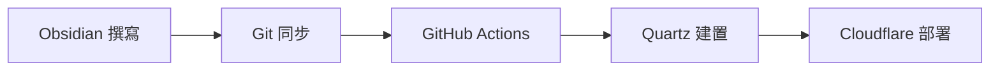

# 關於 cavegeek.ai

歡迎來到 cavegeek.ai，一個專注於技術知識分享與探索的數位平台。

## 我們的使命

> "在知識的洞穴中，點燃智慧的火焰"

我們相信知識應該被分享，技術應該讓世界變得更美好。cavegeek.ai 致力於：

- **知識傳播**: 將複雜的技術概念轉化為易懂的內容
- **社群建設**: 連接志同道合的技術愛好者
- **創新探索**: 追蹤技術前沿，探索新的可能性
- **實踐分享**: 分享真實的專案經驗與教訓

## 內容特色

### 🔬 深度技術探討
我們不只分享「如何做」，更關注「為什麼」和「何時用」。每篇文章都力求提供深度見解和實用價值。

### 🌐 跨領域整合  
技術不是孤島。我們探討 AI、程式開發、專案管理、商業思維之間的連結，提供全方位的視野。

### 📝 實戰經驗分享
所有內容都基於真實的專案經驗和實踐心得，避免紙上談兵。

### 🤖 AI 時代適應
特別關注 AI 對各個領域的影響，幫助讀者適應並善用 AI 工具。

## 技術理念

### 現代化工作流程
我們採用 [Obsidian](https://obsidian.md/) + [Quartz](https://quartz.jzhao.xyz/) 的現代化內容管理流程：

### 知識連結網絡
透過雙向連結和知識圖譜，我們的內容形成一個有機的知識網絡，讓讀者能夠深度探索相關主題。

### 開放透明
我們的技術架構、建置過程都是開放透明的，歡迎技術同好一起改進和優化。

## 團隊理念

### 持續學習
技術日新月異，我們保持謙卑的學習態度，與讀者一起成長。

### 質量至上
寧願少而精，也不願多而雜。每一篇內容都經過深思熟慮。

### 社群導向
我們重視與讀者的互動，歡迎討論、建議和批評指正。

## 聯絡我們

如果您對我們的內容有任何想法、建議或合作提案，歡迎與我們聯繫：

- 📧 Email: [contact@cavegeek.ai](mailto:contact@cavegeek.ai)
- 💬 GitHub: [github.com/iantuan/cavegeek-ai](https://github.com/iantuan/cavegeek-ai)

---

**感謝您的閱讀與支持！一起在技術的世界中探索無限可能** 🚀