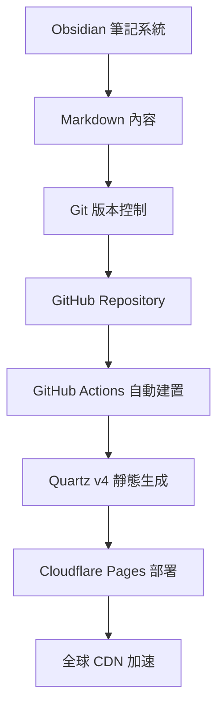

# 歡迎來到 cavegeek.ai - 我們的技術探索之旅開始了！

今天，我們正式推出 cavegeek.ai 這個技術知識分享平台！這不只是一個部落格，而是一個致力於探索技術前沿、分享實用知識的數位空間。

## 為什麼選擇 "cavegeek.ai"？

### "Cave" - 知識的洞穴
在柏拉圖的洞穴寓言中，洞穴代表了我們對現實的有限認知。而在 cavegeek.ai，我們把洞穴重新定義為**知識探索的起點**。每一個技術概念、每一次學習經歷，都是從這個洞穴開始的探索之旅。

### "Geek" - 技術的熱情
我們是 Geek，對技術有著純粹的熱情。不是為了炫技，而是因為相信技術能讓世界變得更美好。

### ".ai" - 人工智慧時代
我們正處在一個由 AI 重新定義的時代。cavegeek.ai 將特別關注 AI 對各個技術領域的影響與機會。

## 我們的技術架構

作為一個技術平台，我們當然要用最適合的技術棧來建構：

### 現代化內容管理流程

### 為什麼選擇 Quartz v4？

1. **完美的 Obsidian 整合**: 原生支援 WikiLinks、雙向連結、知識圖譜
2. **現代化架構**: 基於 TypeScript + Preact，效能出色
3. **豐富的功能**: 搜尋、標籤、分類、RSS 一應俱全
4. **客製化友好**: 基於組件的設計，易於修改和擴展

### 知識圖譜的力量

不同於傳統的線性部落格，我們的內容通過**雙向連結**形成一個知識網絡。你可以從一篇關於 AI 的文章，自然地連接到相關的程式設計技巧或專案管理經驗。

## 我們將分享什麼？

### 🤖 AI & 機器學習
- ChatGPT 等大語言模型的實用技巧
- 機器學習專案的完整實作
- AI 工具在日常工作中的應用

### 💻 程式開發
- Python、JavaScript、Go 等語言的深度探討
- 框架與工具的最佳實踐
- 程式碼品質與架構設計

### 📋 專案管理
- 敏捷開發的實戰經驗
- 團隊協作工具與方法
- 技術專案的風險管理

### 💡 商業 + 技術
- 技術決策的商業考量
- 產品開發中的技術選型
- 創業公司的技術架構演進

## 我們的承諾

### 1. 質量優於數量
每一篇文章都經過深思熟慮，確保能為讀者帶來實際價值。

### 2. 實戰導向
所有內容都基於真實的專案經驗，避免紙上談兵。

### 3. 持續更新
技術在變化，我們的內容也會持續更新和改進。

### 4. 社群互動
歡迎讀者的回饋、建議和討論，一起共建知識社群。

## 下一步計畫

接下來幾週，我們將陸續發布：

- **Quartz v4 完整架設指南**: 詳細記錄本站的建置過程
- **Obsidian 高效工作流**: 分享我們的筆記系統和知識管理方法
- **AI 輔助開發實戰**: ChatGPT 在程式開發中的實用技巧
- **專案管理工具評測**: 比較各種 PM 工具的優缺點

## 邀請你一起探索

cavegeek.ai 不只是我們的平台，也是所有技術愛好者的共同空間。無論你是：

- 🚀 資深開發者，歡迎分享你的經驗
- 📚 技術學習者，歡迎提出你的疑問  
- 💼 專案經理，歡迎討論實務問題
- 🤖 AI 探索者，歡迎一起研究新可能

**讓我們一起在知識的洞穴中，點燃智慧的火焰！** 🔥

---

*有任何想法或建議嗎？歡迎透過 [GitHub Issues](https://github.com/iantuan/cavegeek-ai/issues) 與我們分享！*