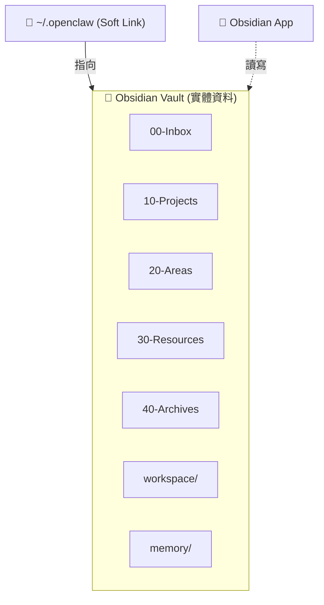

如果你關注 AI 個人助理的發展，可能已經聽過 OpenClaw —— 一個開源的 AI 助手框架。但你知道嗎？OpenClaw 選擇了一個獨特的「家」：Obsidian。

## 為什麼是 Obsidian？

傳統上，AI 助手的設定和資料通常存放在 JSON、YAML 或資料庫中。但 OpenClaw 選擇使用 **Obsidian Vault** 作為其核心，這個決定有其深層考量：

### 1. 雙向連結的超能力

Obsidian 最大的特色是 **雙向連結（Bidirectional Links）**。這讓 OpenClaw 的各個模組、指令、知識點不再是孤島，而是形成一個互相連接的知識圖譜。

### 2. Markdown 的純粹

所有資料都是 Markdown —— 一種人類可讀、機器也可解析的格式。這意味著：
- 版本控制更容易（Git friendly）
- 跨平台遷移無痛
- 與各種 CLI 工具完美配合

### 3. 豐富的插件生態

Obsidian 有數千款插件，從 Dataview 到 Templater，從 Kanban 到 OCR。這讓 OpenClaw 可以利用這些工具來增强功能。

## 🔗 核心設計：Soft Link 魔法

這個架構最聰明的地方在於使用 **Soft Link（符號連結）** 將 `~/.openclaw` 指向 Obsidian Vault。實體資料存放在 Obsidian Vault 中，`~/.openclaw` 只是一個指向它的符號連結。

### 如何設定？

整個流程分三步：先讓 OpenClaw 正常安裝產生 `~/.openclaw`，再把它搬進 Obsidian Vault，最後建立符號連結指回去。

```bash
# Step 1: 正常安裝 OpenClaw，讓它產生 ~/.openclaw 目錄

# Step 2: 將 ~/.openclaw 搬移到你的 Obsidian Vault 位置
mv ~/.openclaw /path/to/your/obsidian-vault

# Step 3: 建立符號連結，讓 ~/.openclaw 指向 Obsidian Vault
ln -s /path/to/your/obsidian-vault ~/.openclaw
```


這樣的好處是：
- **Obsidian App** 直接開啟該 Vault，就能看到 OpenClaw 的所有檔案
- **OpenClaw** 透過 `~/.openclaw` 讀寫，實際操作的是 Vault 中的資料
- 兩者共享同一份資料，**不需要同步**！



## OpenClaw 的 Obsidian 架構

在我們的設定中，OpenClaw 的 vault 採用 **PARA 組織法**：

```
~/.openclaw/
├── 00-Inbox/          # 收集的想法與任務
├── 10-Projects/       # 正在進行的專案
├── 20-Areas/          # 持續關注的領域
├── 30-Resources/      # 參考資源與素材
├── 40-Archives/       # 已完成的項目
├── 99-System/         # OpenClaw 系統檔案
├── tasks/             # 任務看板
├── memory/            # 對話記憶
└── reports/           # 執行報告
```

## 實際應用場景

### 📝 任務管理

當主人給 AI 一個任務時，它會進入 `00-Inbox`。AI 可以：
1. 讀取現有知識看是否相關
2. 創建執行計劃
3. 將結果寫入對應的專案資料夾

### 🔍 知識整合

AI 可以馬上搜尋 vault 中是否有相關筆記，確保回答具有上下文連貫性。

### 📊 自動記錄

每一次任務執行，AI 會自動產生報告并存入對應目錄，形成完整的執行日誌。

## 這個組合的優勢

| 面向 | 傳統方式 | Obsidian + OpenClaw |
|------|---------|---------------------|
| 資料可讀性 | JSON/資料庫難讀 | Markdown 易讀 |
| 連結能力 | 需自行建立關聯 | 自動雙向連結 |
| 搜尋 | 依賴資料庫查詢 | Dataview + 語意搜尋 |
| 版本控制 | 二進制難處理 | 純文字完美支援 |
| 跨工具整合 | 需寫轉換程式 | 直接讀寫 Markdown |
| 資料同步 | 需額外同步機制 | 共享同一份資料夾 |

## 未來展望

Obsidian 作為 OpenClaw 的家，不只是一個儲存位置，更是一個 **人機協作的空間**。Soft Link 讓 AI 和人類可以在同一個資料夾中無縫協作，這種設計也許會成為未來 AI-Native 應用程式的標準做法。

如果你對這個組合有興趣，不妨試試看 OpenClaw + Obsidian 的搭配！
